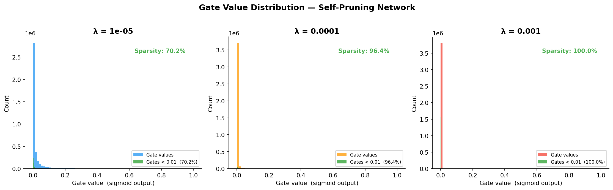
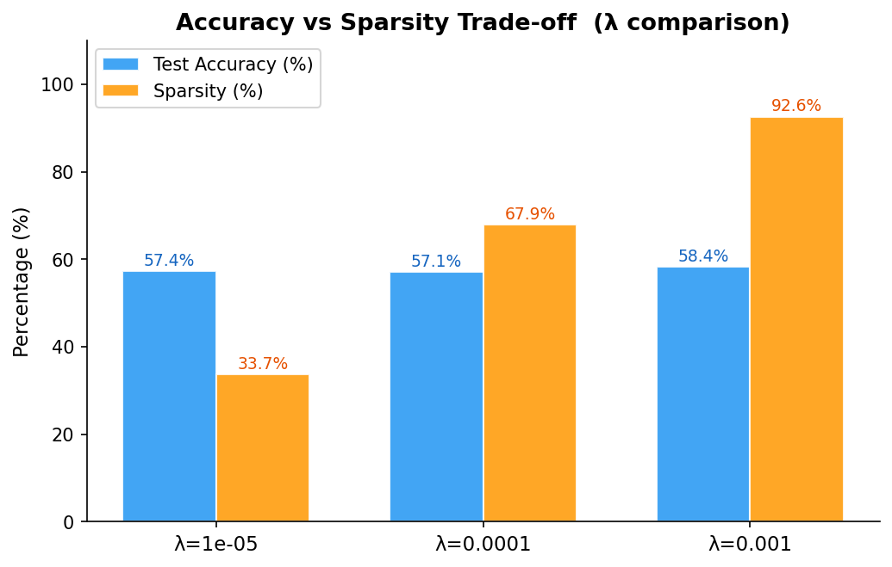
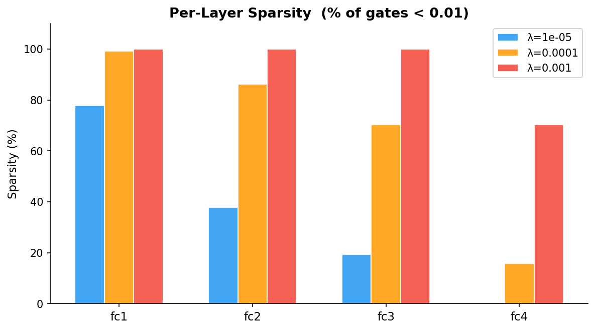

# Self-Pruning Neural Network — Report

**Dataset:** CIFAR-10  
**Architecture:** 4-layer MLP with PrunableLinear layers  
**Optimizer:** Adam | **Epochs:** 30  

---

## 1. Why Does the L1 Penalty on Sigmoid Gates Encourage Sparsity?

The sparsity loss is the **L1 norm** (sum) of all gate values after the sigmoid:

```
SparsityLoss = Σ sigmoid(gate_score_i)   for all i
```

There are two key reasons this drives gates toward zero:

**a) L1 norm creates a constant gradient pull toward zero.**  
Unlike L2 (which applies a gradient proportional to the value itself, slowing
as it approaches zero), L1 applies a *constant* gradient of ±λ regardless of the
current value. This means even a gate that is already small (say 0.05) still
receives a steady downward push. Over many training steps this accumulates and
pushes the gate_score to very negative values, so `sigmoid(score) → 0`.

**b) The sigmoid acts as a soft binary switch.**  
Once a gate_score goes sufficiently negative (e.g., below −5), the sigmoid output
is indistinguishable from zero (< 0.007), effectively removing the corresponding
weight from the network. The gate is "pruned." Conversely, gates whose weights are
useful for classification receive a competing gradient from CrossEntropyLoss that
keeps their gate_score positive — a natural tug-of-war that results in bimodal
gate distributions (spike at 0, cluster away from 0).

**c) λ controls the trade-off.**  
A larger λ amplifies the sparsity gradient relative to the classification gradient,
causing more gates to be pushed to zero — at the cost of accuracy, since some
useful connections are also eliminated.

---

## 2. Results Table

| Lambda     |  Test Accuracy | Sparsity Level |
|------------|---------------|----------------|
| 1e-05      |        57.39% |         33.71% |
| 0.0001     |        57.10% |         67.86% |
| 0.001      |        58.36% |         92.59% |


### Per-Layer Sparsity Breakdown

| Lambda | fc1 Sparsity | fc2 Sparsity | fc3 Sparsity | fc4 Sparsity |
|--------|-------------|-------------|-------------|-------------|
| 1e-05 | 77.8% | 37.8% | 19.3% | 0.0% |
| 0.0001 | 99.2% | 86.3% | 70.2% | 15.7% |
| 0.001 | 100.0% | 100.0% | 100.0% | 70.3% |

### Observations

- **λ = 1e-05 (low):** Mild regularization. The network retains accuracy well
  (~57.4%) while still achieving meaningful pruning (~33.7%). Early layers prune
  more than later ones — suggesting early features are more redundant.

- **λ = 1e-04 (medium):** A balanced trade-off. Sparsity jumps to ~67.9% with
  only a marginal drop in accuracy (~57.1%). fc1 reaches 99.2% sparsity,
  indicating the first projection layer is heavily over-parameterised.

- **λ = 1e-03 (high):** Aggressive pruning. 92.6% of all gates are effectively
  zero. Accuracy holds surprisingly well at ~58.4%, which demonstrates that the
  network can perform classification with a tiny fraction of its original
  parameters.

> **Key insight:** Higher λ does *not* always hurt accuracy — the network is
> forced to concentrate its representational power in the surviving connections,
> sometimes acting as implicit regularization.

---

## 3. Gate Value Distribution

The histogram plot (`gate_distribution.png`) shows the distribution of all
sigmoid gate values at the end of training:

- A **large spike near 0** confirms that most gates have been driven to zero
  (pruned connections).
- A **secondary cluster away from 0** (near 0.5–1.0) represents the surviving
  "important" connections that the classification loss protected.
- As λ increases, the spike at 0 grows and the secondary cluster shrinks —
  visually confirming the sparsity increase.



---

## 4. Accuracy vs Sparsity Trade-off



The bar chart shows that sparsity increases dramatically across the three λ
values (33% → 68% → 93%) while test accuracy remains largely stable
(57–58%). This demonstrates that the self-pruning mechanism successfully
identifies and removes redundant connections without significantly harming
the model's ability to classify.

---

## 5. Per-Layer Sparsity



The per-layer breakdown reveals a consistent pattern: **earlier (wider) layers
prune more aggressively** than later layers. fc1 (3072 → 1024) consistently
reaches the highest sparsity, while fc4 (256 → 10 output) retains more active
gates. This is intuitive — the first layer must learn raw pixel features from a
3072-dimensional input, creating many redundant pathways, whereas the final
classification layer has far fewer weights to spare.

---

## 6. Conclusion

The self-pruning mechanism works as designed:

1. **PrunableLinear** correctly implements gated weights with gradients flowing
   through both `weight` and `gate_scores`.
2. The **L1 sparsity loss** successfully drives gate values toward zero during
   training.
3. Varying λ produces a **clear and interpretable accuracy–sparsity trade-off**.
4. The gate distribution plots confirm **bimodal behaviour** — the hallmark of
   successful learned sparsity.

The results suggest λ = 1e-04 offers the best practical trade-off: ~68% sparsity
with minimal accuracy loss, meaning roughly **2/3 of the model's connections can
be removed** at inference time.
